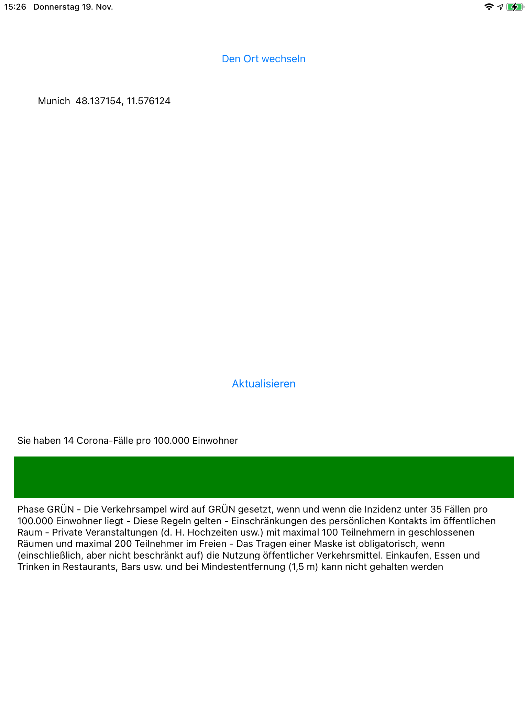

iOS application to show Covid cases in your area

  
  

Instructions to run
Open a terminal at folder Bavaria covid state
Run pod init and pod install
Open the newly created xcworkspace file

How the app works

The app stores the user location as an entry in Core Data. The location entry gets updated every time the system notifies the app about a significant location change, even in the background.
Every 10 minutes the background task scheduler fires to trigger a process - Firebase Cloud Function - that will eventually send back area information (including Covid status and instruction messages for the user). The area information is stored in the Core Data and compared to the old one in order to notify the user on new status code.

How the Firebase Cloud Function and Firestore DB works

Geolocation data (latitude, longitude) are sent to the cloud function along with the user’s device language. The cloud function creates a request to the Covid database server, including the user’s geolocation coordinates. It receives back the json response that will parse and calculate the Covid status code (green, yello, red, darkRed) based on the configuration file with the status code limits. 
The status code is used (by the cloud function) to get the appropriate message instruction from Firestore (a Google Cloud Database). The message will be in english, german or romanian accordingly. 
The response sent back to the client includes: Covid status code, color, message instructions and cases per 100k people.

Objectives for today Saturday 14th of November 2020

iOS device sends its coord (lat, lon) and language to cloud function every 10 min or on press of a button
Cloud function responds back with the Danger Level in the area and a message for the user. To do that, the cloud function will first interrogate the NpGeo DB with covid cases, parse json response, analyse the danger level, get the appropriate message from the Cloud Firestore database.
The iOS device receives the response from the cloud function, stores response time, danger level and message for the user. Shows a notification if needed.

Objectives for today Monday 16th of  November

Add real lat, lon coord to url in cloud function
Get message alert to show in desired language - from Firestore
Send all to the client - including color, message, danger level code..
The client stores this in Core Data - in the background
Notification if danger level has changed since last time
Change app UI color and text message
UI - show location name - if time allows - using coord and Google Maps API

Objectives for today Tuesday 17th of November

Think about UI. User screen, testing screen
Build a UI sketch in Adobe XD
Write a function - observe a managed object context. Handling notifications.

Objectives for today Wednesday 18th of November

Bug fixing
Notification is not shown
UI improvements
Code rearrangements
Testing. Write tests.
Texts internationalisation
Notifications on tribute code

Tests performed

The app self updates with location (lat, lon) even during the night. Stores location in Core Data. Check out the logs with stored coordinates (latitude printed): 
location 44.312587807603784 Optional(2020-11-18 09:22:07 +0000)
location 44.312587807603784 Optional(2020-11-18 09:20:14 +0000)
location 44.312587807603784 Optional(2020-11-18 09:16:28 +0000)
location 44.312587807603784 Optional(2020-11-18 08:05:38 +0000)
location 44.312587807603784 Optional(2020-11-18 06:15:58 +0000)
 
The app’s  Background Task Scheduler fires every 10 minutes, triggering the Firebase Cloud Function. Check out some logs from the Firebase Functions:
8:38:32.490 PM    calculateCovidStatus
Function execution took 416 ms, finished with status code: 200
8:48:36.182 PM    calculateCovidStatus
Function execution took 1831 ms, finished with status code: 200
9:00:31.969 PM    calculateCovidStatus
9:10:33.739 PM    calculateCovidStatus
Function execution took 233 ms, finished with status code: 200
9:22:17.152 PM    calculateCovidStatus

The change in the device preferred language is reflected in the user interface. Instruction messages for Covid protection are shown in german, english and romanian.
All color code are shown - choose fake location and update

Inserting fake location is yet to be debugged

Requirements for this app
The "fictive" User-Story:

You have to build an application for the federal state of Bavaria which's main goal
is to keep the citizens updated on new and upcoming Coronavirus / Covid-19 Regulations.
The federal state of bavaria has decided that restrictions are area based on the 7 days
incidence calculated on the basis of 100.000 Citizens per area.

To get a better feeling the federal state has decided to visualize the current situation
state based on a traffic light but later on the had to add an forth state - so the basic
traffic light idea got an fourth state:

Inital Coronal Signals for Bavaria:

-> Always Important: Keep your distance, wear a mask, wash your hands, air rooms regularly

1, Phase GREEN
- The traffic signal is set to GREEN when and if the incidence is below 35 cases per 100.000 residents
- These rules apply
- Limitations of face-to-face contact in public spaces
- Private events ( i.e. weddings etc. ) with a maximum of 100 participants in closed spaces
and a maximum of 200 participants in the open
- Wearing a mask is mandatory when ( including, but not limited to ) using public transportation,
going shopping, eating and drinking in restaurants, bars, etc. and in case minimum distance (1.5m )
cannot be kept

2, Phase YELLOW
- The traffic signal is set to YELLOW when and if the incidence is between 35 and 50 cases per 100.000 residents
- These rules apply
- Private parties and contacts: no more than two households or ten people
- Wearing a mask is mandatory in heavily frequented spaces, in pedestrian zones, in public buildings,
in secondary schools during class, in universities, for attendees of ( sports ) events, etc.
- Curfew and ban on selling as well as consuming alcohol in public spaces from 23:00 on

3, Phase RED
- The traffic signal is set to RED when and if the incidence is higher than 50 cases per 100.000 residents
- These rules apply
- Private parties and contacts: no more than 5 households or five people
- Wearing a mask is mandatory in heavily frequented spaces, in pedestrian zones, in public buildings,
for all grades during class, in universities, for attendees of ( sports ) events, etc.
- Curfew and ban on selling as well as consuming alcohol in public spaces from 22:00 on
The ADDITONAL Signal for Bavaria

4, Phase DARK RED
- The traffic signal is set to DARK RED when and if the incidence is higher than 100 cases per 100.000 residents
- These rules apply
- Events ( e.g. club meetings, sporting events, cultural events, etc. ) must not exceed 50 persons
- Closing time for food / gastronomy outlets, ban on alcohol sales and alcohol consumption sales in
specific public places form 21:00

Your Tasks:
Now you finally know, the corona situation in the federal state of bavaria ( and a lot of other
worldwide places of course ) is handled like a modern style guessing game of figuring out which regulations
may apply in which area - GREAT JOB.

So for let's develop an iOS Application based on swift which is able to let the user know what he/she/it has
to do in here specific place.

Development instructions for these Application:

- Use GIT
- At your first commit the application should implement all initial states
- in your second commit the application should be altered to also match the additional criteria
- use well explaining Commit Messages
- follow the DDD Pattern, use reusable components and Data Sources where ever possible
- make your Code as SOLID as possible
- work with the cleanCode principles in mind
- make your UI Work in Portrait style, you do not have to make it work in landscape
- use SWIFT 5.3 to develop this app, use the swift package manager when you think it make sense
- use localized Strings where ever text is displayed (NSLocalizedString(...))
- Text in the app should be displayed in German (if the system language is german - or in english - if the system language is not german)
- The application should check every 10 minutes for the property cases7_per_100k from the official rest api for the actual coordinates
of the devices. API and API Documentation under this URL:

https://npgeo-corona-npgeo-de.hub.arcgis.com/data…

